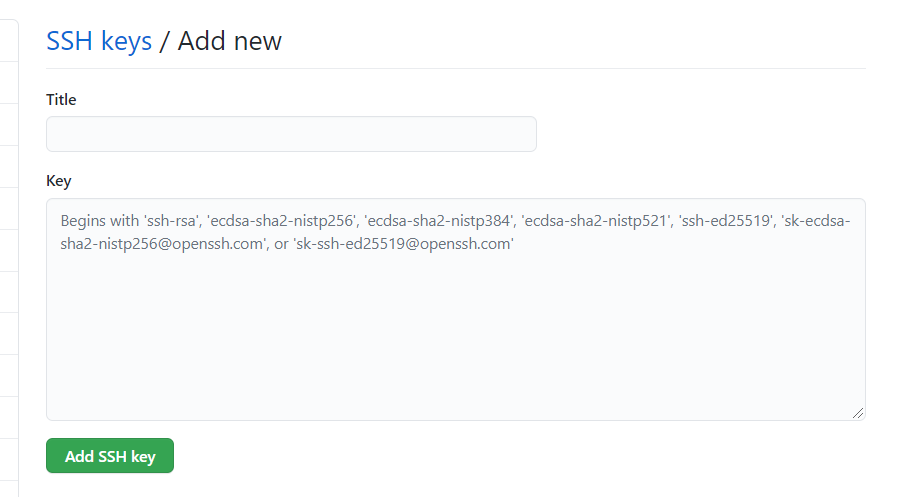

The `cider` is a simple tool of building GitHub pages. It's fast and easy to use. See example: https://www.leyafo.com

## Install
Compiling from source code:  
```bash
go build -o cider main.go
```

## Generate your site through Github Action(Recommending)
1. Folk this project.
2. Gernerate a SSH key for Github Action commit:
```
ssh-keygen -t rsa -b 4096 -C $(git config user.email) -f gh-pages -N ""
```
It will create two files: `gh-pages` and `gh-pages.pub`.   
Copy all contents of the `gh-pages.pub` into `Github/Setting/SSH and GPG keys/Add SSH Key.`  
   
Copy all contents of the `gh-pages` into `this project(your folkd)/Settings/Secrets/New repository secret`. The name must be **ACTIONS_DEPLOY_KEY**.  
  
3. Create a repository named `your_name.github.io`.    
4. Copy the repository SSH url into `this project(your folkd)/Settings/Secrets/New repository secret`. The name must be **DEPLOY_REPOSITORY**.  


All done, happy writing.   

You can empty all md files in `content` and all images files in `rs/images`, those are my demo contents. When you want to reference an image in your article, you should put the file in `rs/images`. It will be synced to `your_name.github.io` in which all md files are generated.

**Notice:** The CNAME file uploading and domain binding and other settings must be configured with yourself.  

### Showing your site on local
`./cider s`

### Classify your articles
If you want to classify your articles into different groups, you should create a subfolder into `content`, and then add the folder link into `templates/partials/_nav.html.tpl`. For example, if you have written an article about English learning, and want to create a English Learning group in your website.
```bash
mkdir content/el
mv your_md_file content/el/
```

Add `el` into `templates/partials/_nav.html.tpl`
```html
[ <a class="nav-btn" href="/el/">English</a> ]
```

### Insert an image into your article
Create a `images` folder in public, copy your picture into the folder, write the relative path in your article.
```markdown

```

## License

MIT
